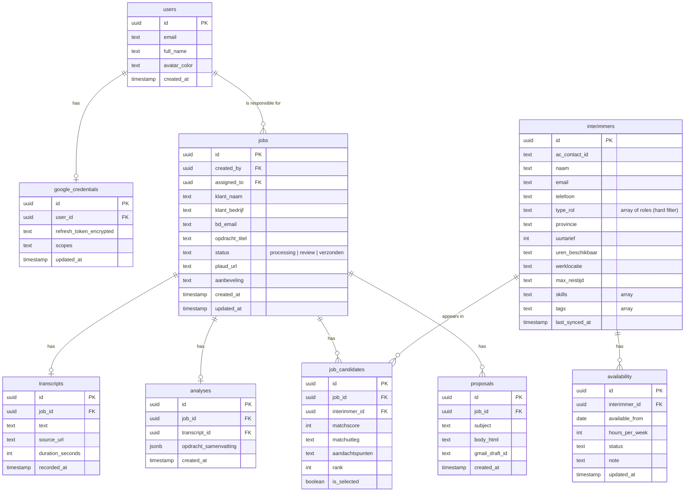

# Happy Talents — Database Design

Data model for the intake application, hosted on Supabase (PostgreSQL, EU region).
This is the agreed design; it stays consistent with the API contract in `API.md`
and the frontend data contract in `Happy-Talents-Frontend/src/lib/types.ts`.

## ER diagram

## Tables

| Table | Role | Key relations |
|---|---|---|
| `users` | Business-team members (mirrors Supabase `auth.users`, plus app fields like `avatar_color` for the kanban). | — |
| `google_credentials` | Encrypted Google OAuth2 refresh token + scopes per user. Separate table for strict RLS (see Security). | → `users` (1:1) |
| `interimmers` | Interimmer/candidate data, synced from Active Campaign (`ac_contact_id`, `last_synced_at`). | — |
| `availability` *(optional)* | Manual availability management per interimmer (could-have). Standalone connection to the interimmer data. | → `interimmers` (1:N) |
| `jobs` | The intake/assignment. `created_by` = who entered it, `assigned_to` = the responsible owner (manually set). | → `users` (`created_by`, `assigned_to`) |
| `job_candidates` | Shortlist join (job ↔ interimmer) with per-match fields: `matchscore`, `matchuitleg`, `aandachtspunten`, `rank`, `is_selected`. | → `jobs`, `interimmers` |
| `transcripts` | Plaud transcript fetched in step 1. | → `jobs` |
| `analyses` | AI analysis output (`opdracht_samenvatting` as jsonb) from step 2. | → `jobs`, `transcripts` |
| `proposals` | Generated proposal email + `gmail_draft_id` from step 4. | → `jobs` |

## Design notes

- **Pipeline lineage.** `transcripts` → `analyses` → `job_candidates` → `proposals` are
  separate tables, all hanging off `jobs`. This keeps clean audit/explainability and
  mirrors the separate pipeline endpoints in `API.md`.
- **Arrays.** `type_rol`, `skills`, `tags` are Postgres `text[]`. `type_rol` is an array
  because an interimmer can hold multiple roles — it is the single hard filter during
  matching.
- **jsonb for rich data.** `opdracht_samenvatting` is stored as `jsonb` (nested object:
  pijnpunten, competenties, sector, budget, ...). Fields that later need filtering/search
  can be promoted to dedicated columns.
- **Active Campaign as source.** `interimmers` is a cache synced from Active Campaign; the
  matching query runs against Supabase for speed and to constrain the LLM to existing
  roles.
- **Ownership for RLS.** Every `jobs` row carries `created_by` (and optionally
  `assigned_to`), so even an unassigned, just-received job is attributable to a user —
  required for clean row-level security.

## Security (GDPR — see technical plan §7)

- `google_credentials.refresh_token_encrypted` is encrypted at rest (KMS/pgcrypto), never
  stored in plain text.
- RLS so only the backend service role can read tokens; users cannot read their own raw token.
- All data stored in the EU (Supabase West-Europe).
