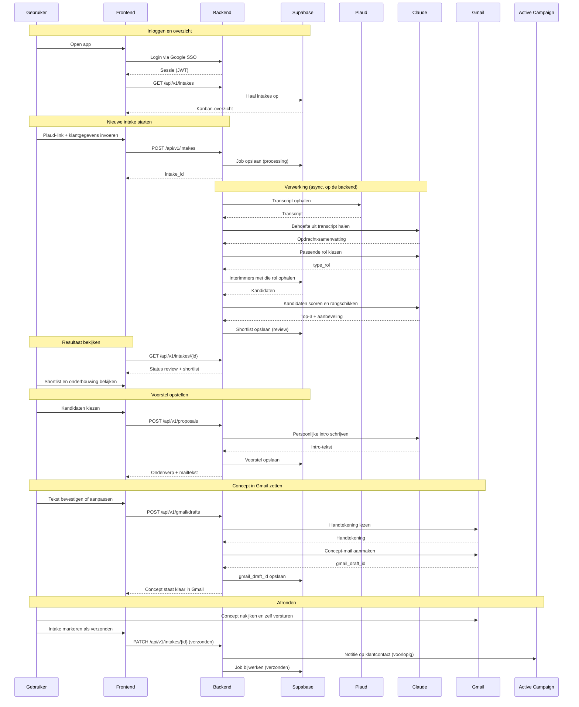

# Happy Talents — Dataflow

End-to-end flow of the intake application, from login to a finished Gmail draft.
Consistent with the endpoints in `API.md` and the data model in `DATABASE.md`.
The whole flow is **user-triggered** — there are no scheduled jobs.

## Sequence diagram

## Notes

- **Login & overview.** The user logs in via Google SSO (Supabase Auth); the
  frontend loads the kanban overview of intakes.
- **Async processing.** Starting an intake returns an `intake_id` immediately; the
  pipeline (transcript → analysis → role selection → candidate query → ranking) runs
  on the backend. The frontend polls `GET /api/v1/intakes/{id}` until status `review`.
- **Matching reads from Supabase.** Interimmers are queried from Supabase; how that
  data is populated from Active Campaign is out of scope for now.
- **User sends the email.** The app only creates the Gmail draft (see technical plan
  §5.3). The user reviews and sends it manually, then marks the intake as `verzonden`.
- **Active Campaign note is provisional** (see `API.md` / technical plan §12),
  triggered on completion.
